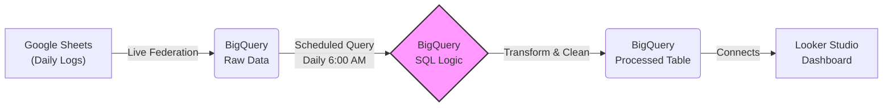

# Cleaning Operations Reporting Automation

This repository contains a BigQuery SQL query used to automate the reporting of staff load balancing for cleaning operations. The solution integrates Google Sheets as the data source, utilizes BigQuery for orchestration and data transformation, and visualizes the data through Looker Studio.

## Project Overview

The primary aim of this project is to provide automated, accurate, and easily interpretable reporting for cleaning operations. By leveraging Google Sheets, BigQuery, and Looker Studio, we ensure a seamless data pipeline from data entry to meaningful visualization.

### Key Features:
- **Live Federation:** Integration with Google Sheets as the raw data source.
- **Serverless Automation:** Utilizes BigQuery Scheduled Queries to minimize infrastructure.
- **Advanced Logic:** SQL logic calculates workload status using window functions and modular arithmetic.
- **Traffic Light System:** Visual indicators (Red/Yellow/Green) in Looker Studio for instant status checks.

## Architecture Pipeline

### 📐 Architecture Pipeline

## Business Logic Explanation

The core of this project is the SQL logic that translates raw numbers into actionable business insights.

1. Traffic Light System (Operational Status)

The query evaluates daily workload against specific thresholds to assign a status:
- 🔴 Overloaded: Staff are processing >3 orders/day. Immediate help needed.
- 🟢 Perfect Load: Staff are handling ≥2 orders/day with even distribution. Ideal efficiency.
- 🟡 Underutilized: Staff are handling <2 orders/day. Opportunity to assign more tasks.
- ⚪ Unbalanced: Workload distribution does not meet efficiency criteria.

2. Roster Context (Fairness Check)

We use Modular Arithmetic (MOD) to automatically generate a text explanation for managers:
- Equal Work: If Orders % Staff == 0, the system reports "Everyone does equal work."
- Uneven Work: If the division isn't even, the system calculates the remainder to explain the split (e.g., "5 staff do 2 orders, 1 staff does 3 orders").

## Setup Instructions

Follow these steps to deploy the solution:

1. Google Sheets Setup:
- Create a Google Sheet with fields: Shift ID, Employee Name, Assigned Load, and Shift Date.

2. BigQuery Configuration:
- Link the Google Sheet as an External Table.
- Create a new Scheduled Query and paste the SQL script from logic/staff_load_analysis.sql.

3. Visualization:
- Connect Looker Studio to the view created by your scheduled query.
- Use "Conditional Formatting" in Looker Studio to apply the Red/Green/Yellow colors based on the operational_status column.

---

### Contribution
Contributions, issues, and feature requests are welcome! Feel free to check the issues page.

### Acknowledgments
Special thanks to the cleaning operations team for providing insights on workforce optimization benchmarks.
